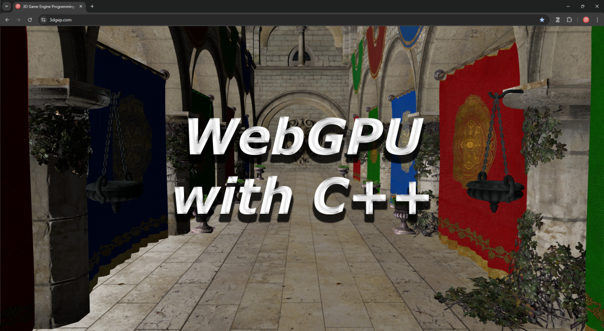
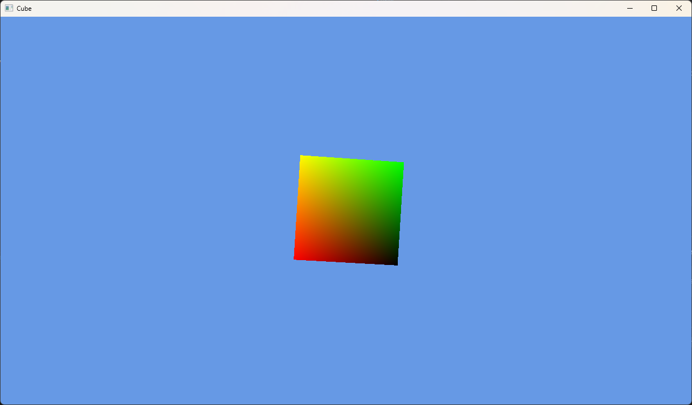

# Learn WebGPU with C++



## Download the Repo

This repository uses submodules for a few of the external dependencies. Make sure you use `--recurse-submodules` when cloning the repo:

```sh
git clone --recurse-submodules https://github.com/3dgep/LearnWebGPU.git
```

If you cloned the repo but forgot to initialize the submodules, you can do that with the following command:

```sh
git submodule update --init
```

## Installing Dependencies

### CMake

Download the latest version of CMake from [https://cmake.org/download](https://cmake.org/download/)

### Python

Make sure you have the latest version of Python installed.

Check which version of Python you currently have:

```sh
python --version
```

### Ninja Build

The Ninja build system is used to build the browser version of our application.

Check which version of Ninja you currently have:

```sh
ninja --version
```

If you don't have Ninja installed, you can use one of the options below to install it.

#### Windows

```sh
winget install Ninja-build.Ninja
```

#### Mac

```sh
brew install ninja
```

#### Linux

* Debian/Ubuntu

```sh
apt-get install ninja-build
```

See [Pre built Ninja packages](https://github.com/ninja-build/ninja/wiki/Pre-built-Ninja-packages) for more package managers.

### Visual Studio 2022

Make sure you install the latest version of Visual Studio. Even if you don't intend to use the Visual Studio IDE, you need to have the C++ toolchain installed for other IDEs (like Visual Studio Code) to build the C++ projects.

[https://visualstudio.microsoft.com/](https://visualstudio.microsoft.com/)

> **Note**: I haven't figured out how to build & debug the application with Visual Studio when using the Emscripten toolchain. Visual Studio Code (with the CMake plugin) is much better for this.

### Visual Studio Code

Visual Studio Code is better for building and debugging the Emscripten builds.

There are several launch & tasks configurations to simplify debugging the application in the browser.

Visual Studio code is preferred when creating web builds with Emscripten.

[https://visualstudio.microsoft.com/](https://visualstudio.microsoft.com/)

#### Recommended Visual Studio Code Extensions

This project includes an [extensions.json](.vscode/extensions.json) file for Visual Studio Code.

* C/C++ for Visual Studio Code
* CMake Tools
* Live Preview

### Emscripten

This project comes with Emscripten as a Git submodule.
We need to install and activate the version of Emscripten that will be used for this project.

Run the following commands to install and activate the version of Emscripten that is used for this project.

```sh
git submodule update --init tools/emsdk
cd tools/emsdk
.\emsdk install 3.1.65
.\emsdk activate --permanent 3.1.65
```

## Configure

This project uses CMake for project configuration. There are build presets for Visual Studio 2022 (v17) and Emscripten.

### Configure Visual Studio 2022

```sh
cmake --preset vs17
```

### Configure Emscripten

```sh
cmake --preset Emscripten
```

## Building

After the project has been compiled, you can open the generated solution file in Visual Studio, or use CMake to build the project.

### Building with Visual Studio

```sh
cmake --build --preset x64-Debug
```

### Building with Emscripten

```sh
cmake --build --preset Emscripten-Debug
```

## Running

If the build was successful, you should be able to run one of the samples.

```sh
.\out\build\vs17\samples\02-Cube\Debug\02-Cube.exe
```

Or run in the browser, start a local web server:

```sh
python -m http.server
```

And open the following page in Chrome (or Edge):

[http://localhost:8000/out/build/emscripten/samples/02-Cube/Debug/02-Cube.html](http://localhost:8000/out/build/emscripten/samples/02-Cube/Debug/02-Cube.html)



## Known Issues

* When using the Dawn WebGPU backend, the `fetch_dawn_dependencies.py` script can fail in cmake-gui with the error `OSError: [WinError 6] The handle is invalid`.
  * Solution: run cmake on the command line:
    * `cmake --preset vs17 -D WEBGPU_BACKEND=DAWN`
* Compiling with Emscripten can sometimes fail with compilation errors if the build toolchain is not activated or when reconfiguring the CMake project.
  * Solution:
    * Make sure you have activated the Emscripten build toolchain using the command `.\emsdk activate --permanent 3.1.65` (while in the `tools/emsdk` folder).
    * Delete the `out/emscripten` folder and reconfigure & rebuild the project.

